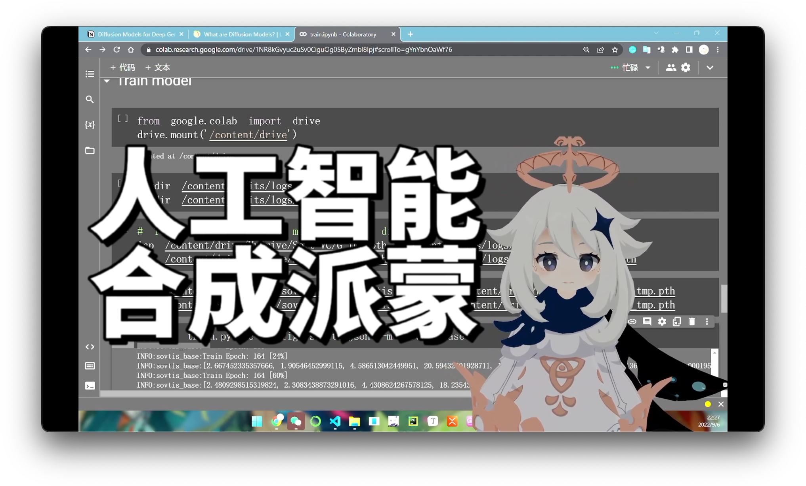

# VITS - Paimon 项目使用说明



## 项目概述
原始项目：https://github.com/AlexandaJerry/vits-mandarin-biaobei
本项目为补档项目，原项目已经不能被看到了
本项目基于 VITS 模型实现了派蒙语音合成功能，方便其他程序调用语音合成服务。

## 环境要求
- **Python 版本**：Python 3.11
- **CUDA 支持**：需要安装 CUDA Toolkit 和相应的 cuDNN。

## 安装步骤

### 1. 安装 CUDA Toolkit
如果你希望使用 NVIDIA GPU 进行加速，需要安装 CUDA Toolkit。请自行访问 [NVIDIA CUDA Toolkit 下载页面](https://developer.nvidia.com/cuda-downloads)。下载安装程序。按照提示完成安装。安装完成后，运行nvcc --version可以输出cuda版本。

### 2. 安装项目依赖
在项目根目录下，使用以下命令安装项目所需的依赖：
```bash
pip install -r requirements.txt
```
确保 `requirements.txt` 文件包含了项目所需的所有依赖库及其版本信息。

### 3. 编译 Cython 代码（如果有）
项目中包含 Cython 代码（如 `core.pyx`），需要进行编译。在项目根目录下执行以下命令：
```bash
python setup.py build_ext --inplace
```

### 4. 拷贝模型
将[模型G_1434000.pth](https://zenodo.org/records/13347529)拷贝到项目目录中

## 使用方法

### 作为库使用
简单转化并测试功能：
```bash
python.exe vits_paimon_api.py
```

## 贡献
如果你想为项目做出贡献，请提交 Pull Request 或提交 Issue 反馈问题。

## 许可证
本项目采用 [许可证名称] 许可证，详情请参阅 `LICENSE` 文件。